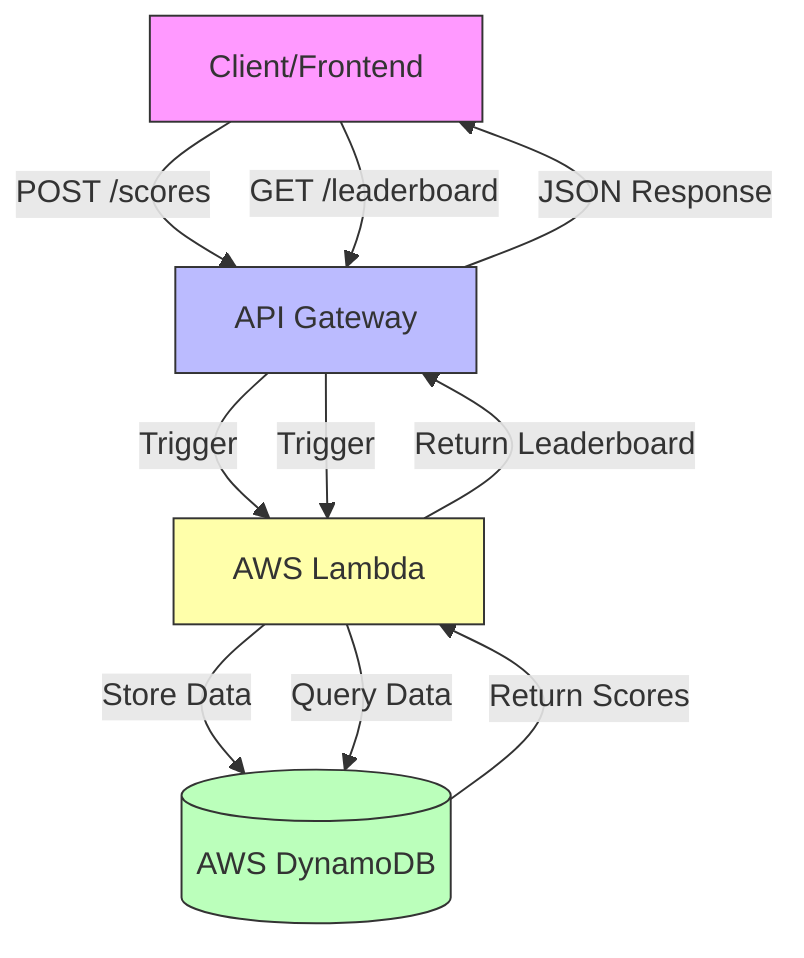

```mermaid
flowchart TB
    Client[Client/Frontend]
    Gateway[API Gateway]
    Lambda[AWS Lambda]
    DynamoDB[(AWS DynamoDB)]

    %% POST Flow
    Client -->|POST /scores| Gateway
    Gateway -->|Trigger| Lambda
    Lambda -->|Store Data| DynamoDB

    %% GET Flow
    Client -->|GET /leaderboard| Gateway
    Gateway -->|Trigger| Lambda
    Lambda -->|Query Data| DynamoDB
    DynamoDB -->|Return Scores| Lambda
    Lambda -->|Return Leaderboard| Gateway
    Gateway -->|JSON Response| Client

    %% Styling
    style Client fill:#f9f,stroke:#333
    style Gateway fill:#bbf,stroke:#333
    style Lambda fill:#ffa,stroke:#333
    style DynamoDB fill:#bfb,stroke:#333
```