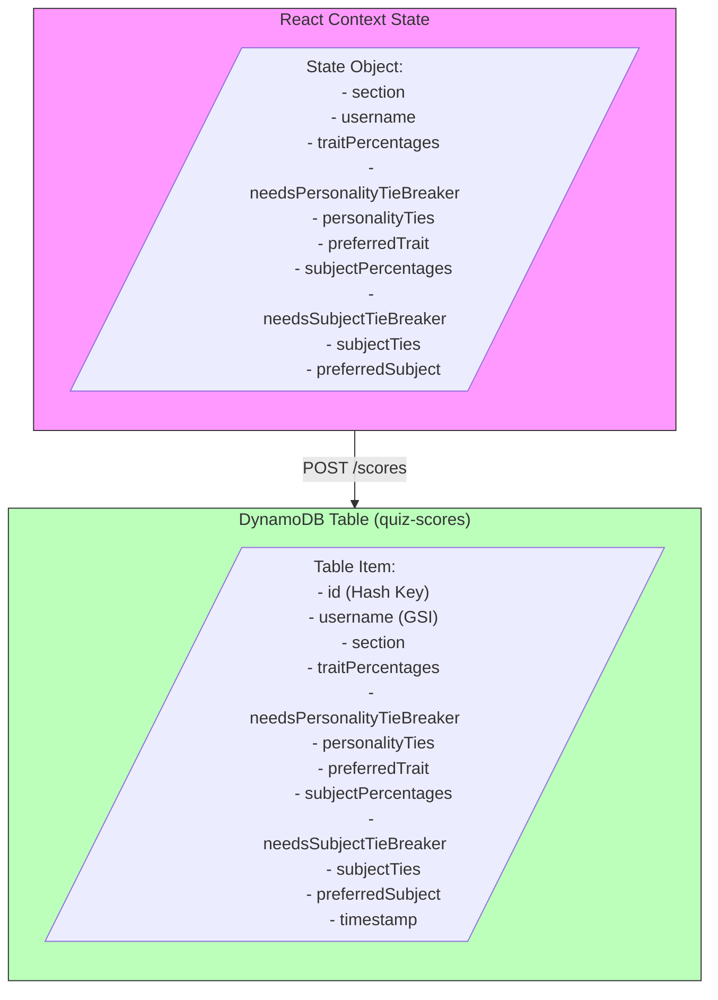

```mermaid
flowchart TB
    subgraph ReactContext["React Context State"]
        direction TB
        RC[/"State Object:
        - section
        - username
        - traitPercentages
        - needsPersonalityTieBreaker
        - personalityTies
        - preferredTrait
        - subjectPercentages
        - needsSubjectTieBreaker
        - subjectTies
        - preferredSubject"/]
    end

    subgraph DynamoDB["DynamoDB Table (quiz-scores)"]
        direction TB
        DB[/"Table Item:
        - id (Hash Key)
        - username (GSI)
        - section
        - traitPercentages
        - needsPersonalityTieBreaker
        - personalityTies
        - preferredTrait
        - subjectPercentages
        - needsSubjectTieBreaker
        - subjectTies
        - preferredSubject
        - timestamp"/]
    end

    ReactContext -->|"POST /scores"| DynamoDB
    
    style ReactContext fill:#f9f,stroke:#333
    style DynamoDB fill:#bfb,stroke:#333
```