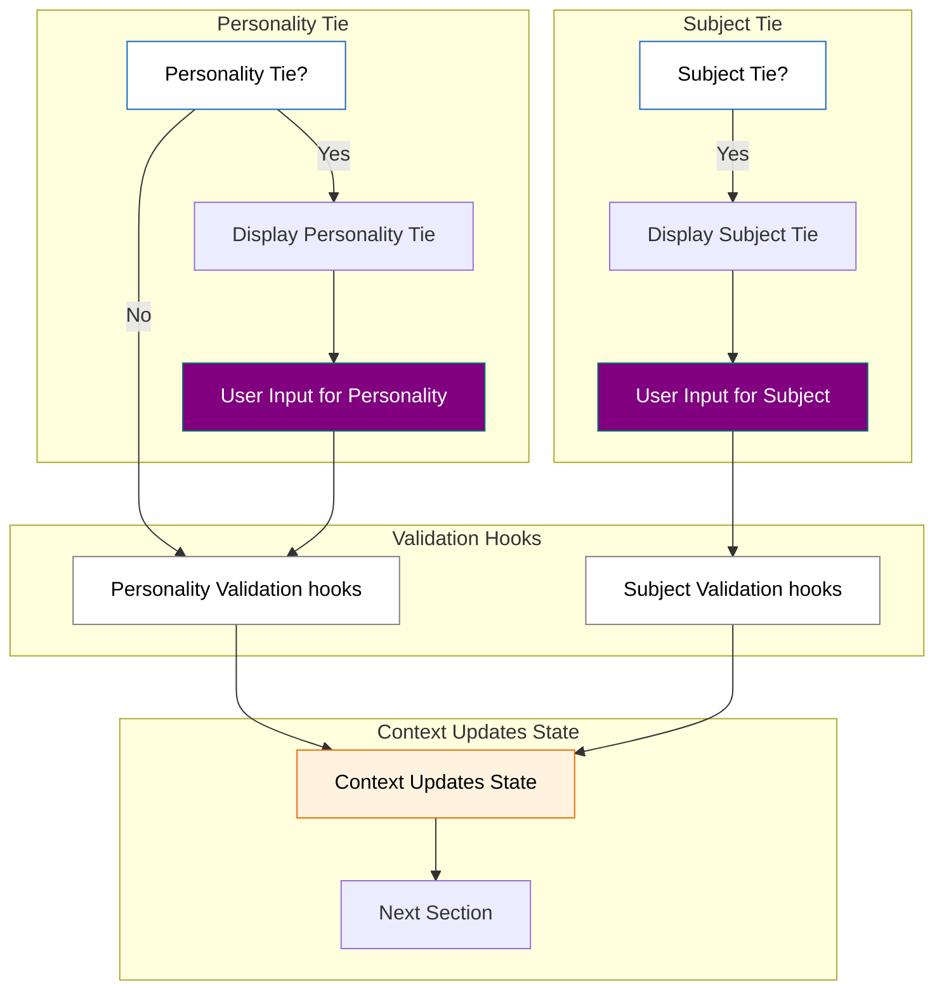

```mermaid
   flowchart TB

       subgraph PersonalityTie ["Personality Tie"]
         %% Check Personality first lane
         P[Personality Tie?]
         
         P -->|Yes| C[Display Personality Tie]

         %% Personality Tie Calculation
         C --> D[User Input for Personality]      
       end

       subgraph SubjectTie ["Subject Tie"]
         %% Check Subject second lane
         S[Subject Tie?]
         S -->|Yes| G[Display Subject Tie]
         G --> H[User Input for Subject]

       end

       %% Context Updates State
       subgraph ValidationHooks ["Validation Hooks"]
         P -->|No| PV
         D --> PV[Personality Tie Results]
         H --> SV
         PV[Personality Validation hooks]
         SV[Subject Validation hooks]

       end

       subgraph ContextUpdates ["Context Updates State"]
         PV --> CUS[Context Updates State]
         SV --> CUS[Context Updates State]
         CUS --> NS[Next Section]
       end

       classDef decision fill:white,stroke:#1565c0,color:#000
       classDef validation fill:white,stroke:grey,color:#000
       classDef context fill:#fff3e0,stroke:#ef6c00,color:#000
       classDef userInput fill:purple,stroke:#00796b,color:white

       class B,P,S decision
       class A,C,E,F,G,I,J,K,L,M,N,O action
       class D,H userInput
       class PV,SV validation
       class CUS context
``` 