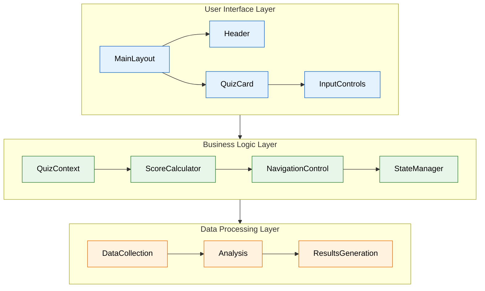

```mermaid
flowchart TB
    %% Row 1: UI Components
    subgraph UI ["User Interface Layer"]
        direction LR
        A[MainLayout] --> B[Header]
        A --> C[QuizCard]
        C --> D[InputControls]
    end
    
    %% Row 2: Business Logic
    subgraph Logic ["Business Logic Layer"]
        direction LR
        E[QuizContext] --> F[ScoreCalculator]
        F --> G[NavigationControl]
        G --> H[StateManager]
    end
    
    %% Row 3: Data Processing
    subgraph Processing ["Data Processing Layer"]
        direction LR
        I[DataCollection] --> J[Analysis]
        J --> K[ResultsGeneration]
    end

    %% Connect the rows
    UI --> Logic
    Logic --> Processing

    classDef ui fill:#e3f2fd,stroke:#1565c0,color:#000
    classDef logic fill:#e8f5e9,stroke:#2e7d32,color:#000
    classDef process fill:#fff3e0,stroke:#ef6c00,color:#000

    class A,B,C,D ui
    class E,F,G,H logic
    class I,J,K process
```
