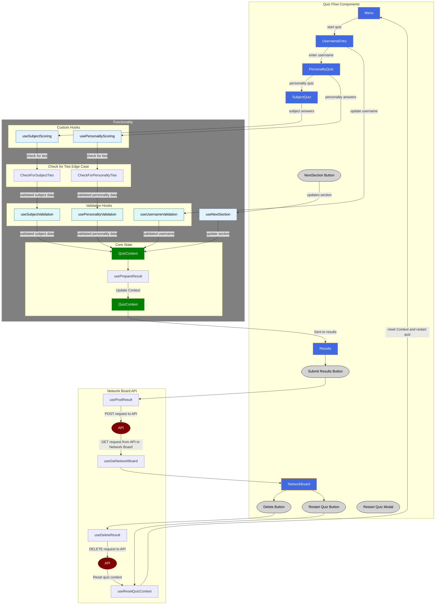

```mermaid
   graph TD
       subgraph QuizFlowComponents ["Quiz Flow Components"]
           direction LR
           M[Menu]
           U[UsernameEntry]
           P[PersonalityQuiz]
           S[SubjectQuiz]
           NS[NextSection Button]
           R[Results]
           NB[NetworkBoard]
           DB[Delete Button]
           RQB[Restart Quiz Button]
           RQM[Restart Quiz Modal]
           SNB[Submit Results Button]
       end

       subgraph Functionality ["Functionality"]
        subgraph CustomHooks ["Custom Hooks"]
            direction LR
            PS[usePersonalityScoring]
            SS[useSubjectScoring]
        end

        

        subgraph CheckForTies ["Check for Ties Edge Case"]
            direction LR
            PST[CheckForPersonalityTies]
            SST[CheckForSubjectTies]
        end

        subgraph ValidationHooks ["Validation Hooks"]
            direction LR
            NU[useUsernameValidation]
            PV[usePersonalityValidation]
            SV[useSubjectValidation]
        end

        subgraph CoreState ["Core State"]
            QC[QuizContext]
            UPR[usePrepareResult]
            QC2[QuizContext]
        end

        N[useNextSection]
    end

       subgraph NetworkBoardAPI ["Network Board API"]
           UPRA[usePostResult]
           UGRA[useGetNetworkBoard]
           UDR[useDeleteResult]
           URQC[useResetQuizContext]
           API[API]
           API2[API]
       end

       %% Menu to UsernameEntry
       M -->|"start quiz"| U
       U -->|"enter username"| P
       P -->|"personality quiz"| S

       %% Data flow connections
       NS -->|"updates section"| N
       P -->|"personality answers"| PS
       PS -->|"check for ties"| PST
       PST -->|"validated personality data"| PV
       S -->|"subject answers"| SS
       SS -->|"check for ties"| SST
       SST -->|"validated subject data"| SV

       %% Custom hooks to validation hooks
       U -->|"update username"| NU

       %% Validation hooks update context
       NU -->|"validated username"| QC
       PV -->|"validated personality data"| QC
       SV -->|"validated subject data"| QC

       %% useNextSection updates section
       N -->|"update section"| QC

       %% Context provides state back to Results
       QC --> UPR
       UPR -->|"Update Context"| QC2
       QC2 -->|"Sent to results"| R
       R --> SNB
       SNB --> UPRA

       %% Results submits data to Network Board API
       UPRA -->|"POST request to API"| API
       API -->|"GET request from API to Network Board"| UGRA
       UGRA --> NB
       NB --> DB
       DB --> UDR
       UDR -->|"DELETE request to API"| API2
       API2 -->|"Reset quiz context"| URQC
       URQC -->|"reset Context and restart quiz"| M
       NB --> RQB
       RQB --> URQC


       classDef flow fill:royalblue,stroke:#ff9800,color:white
       classDef hooks fill:#e3f2fd,stroke:#1565c0,color:#000
       classDef core fill:green,stroke:#2e7d32,color:white
       classDef results fill:#fff3e0,stroke:#ef6c00,color:#000
       classDef validation fill:#e0f7fa,stroke:#00796b,color:#000
       classDef functionality fill:grey,stroke:#9e9e9e,color:white
       classDef api fill:maroon,stroke:#606060,color:white,rx:150px,ry:150px
       classDef buttons fill:lightgrey,stroke:#000000,color:#000,rx:50px,ry:50px
       class M,U,P,S,R,NB flow
       class N,PS,SS hooks
       class PST,SST ties
       class NU,PV,SV validation
       class QC,NA,QC2 core
       class Functionality functionality
       class API,API2 api
       class RQB,DB,NS,SNB,RQM buttons
```