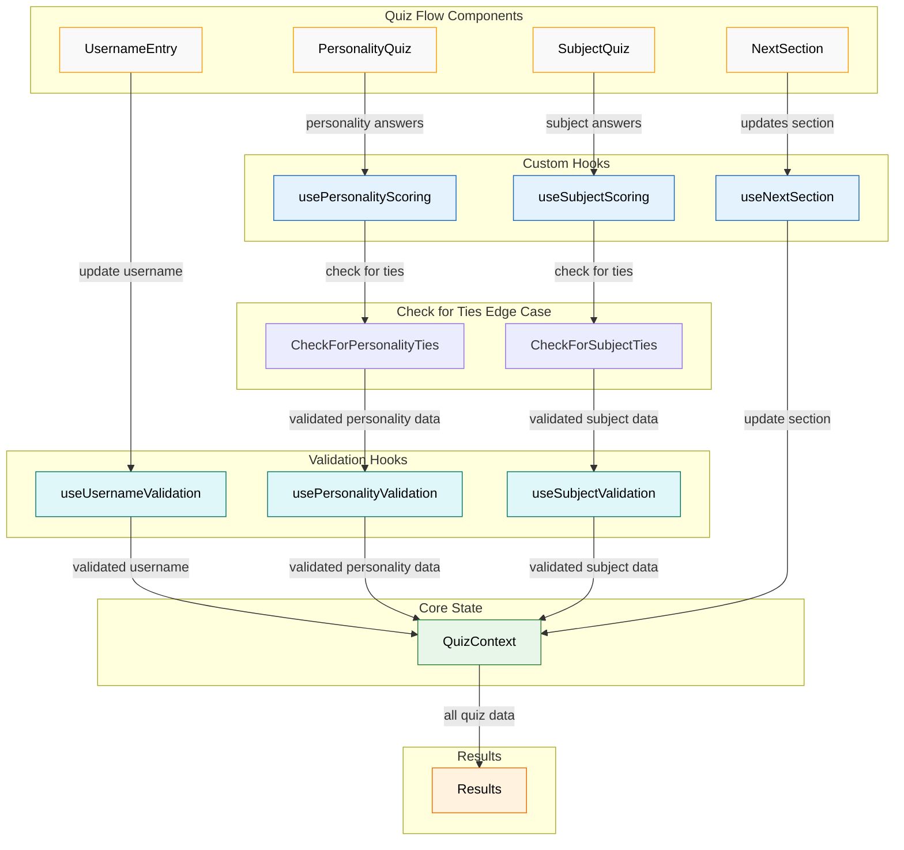

```mermaid
   graph TD
       subgraph QuizFlowComponents ["Quiz Flow Components"]
           direction LR
           U[UsernameEntry]
           P[PersonalityQuiz]
           S[SubjectQuiz]
           NS[NextSection]
       end

       subgraph CustomHooks ["Custom Hooks"]
           direction LR
           N[useNextSection]
           PS[usePersonalityScoring]
           SS[useSubjectScoring]
       end

       subgraph CheckForTies ["Check for Ties Edge Case"]
           direction LR
           PST[CheckForPersonalityTies]
           SST[CheckForSubjectTies]
       end

       subgraph ValidationHooks ["Validation Hooks"]
           direction LR
           NU[useUsernameValidation]
           PV[usePersonalityValidation]
           SV[useSubjectValidation]
       end

       subgraph CoreState ["Core State"]
           QC[QuizContext]
       end

       subgraph ResultsComponent ["Results"]
           R[Results]
       end

       %% Data flow connections
       NS -->|"updates section"| N
       P -->|"personality answers"| PS
       PS -->|"check for ties"| PST
       PST -->|"validated personality data"| PV
       S -->|"subject answers"| SS
       SS -->|"check for ties"| SST
       SST -->|"validated subject data"| SV

       %% Custom hooks to validation hooks
       U -->|"update username"| NU

       %% Validation hooks update context
       NU -->|"validated username"| QC
       PV -->|"validated personality data"| QC
       SV -->|"validated subject data"| QC

       %% useNextSection updates section
       N -->|"update section"| QC

       %% Context provides state back to Results
       QC -->|"all quiz data"| R

       classDef flow fill:#f9f9f9,stroke:#ff9800,color:#000
       classDef hooks fill:#e3f2fd,stroke:#1565c0,color:#000
       classDef core fill:#e8f5e9,stroke:#2e7d32,color:#000
       classDef results fill:#fff3e0,stroke:#ef6c00,color:#000
       classDef validation fill:#e0f7fa,stroke:#00796b,color:#000

       class U,P,S,NS flow
       class N,PS,SS hooks
       class PST,SST ties
       class NU,PV,SV validation
       class QC core
       class R results
```