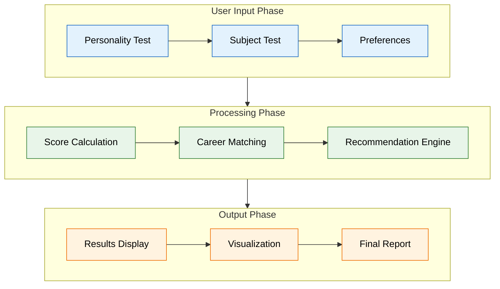

```mermaid
   flowchart TB
       %% Row 1: User Input Collection
       subgraph Input ["User Input Phase"]
           direction LR
           A[Personality Test] --> B[Subject Test]
           B --> C[Preferences]
       end
       
       %% Row 2: Processing Logic
       subgraph Process ["Processing Phase"]
           direction LR
           D[Score Calculation] --> E[Career Matching]
           E --> F[Recommendation Engine]
       end
       
       %% Row 3: Output Generation
       subgraph Output ["Output Phase"]
           direction LR
           G[Results Display] --> H[Visualization]
           H --> I[Final Report]
       end

       %% Connect the rows
       Input --> Process
       Process --> Output

       classDef input fill:#e3f2fd,stroke:#1565c0,color:#000
       classDef process fill:#e8f5e9,stroke:#2e7d32,color:#000
       classDef output fill:#fff3e0,stroke:#ef6c00,color:#000

       class A,B,C input
       class D,E,F process
       class G,H,I output
```