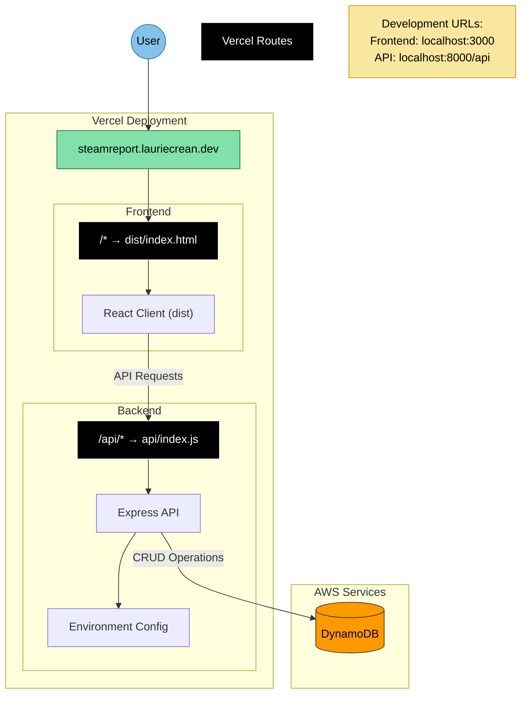

```mermaid
flowchart TB
    User((User)) --> production["steamreport.lauriecrean.dev"]
    
    subgraph "Vercel Deployment"
        production --> RootRoute["/* → dist/index.html"]
        APIRoute["/api/* → api/index.js"]
        
        subgraph "Frontend"
            direction TB
            RootRoute --> Client["React Client (dist)"]
        end
        
        subgraph "Backend"
            direction TB
            APIRoute --> API["Express API"]
            API --> EnvConfig["Environment Config"]
        end
    end

    subgraph "AWS Services"
        DynamoDB[(DynamoDB)]
    end

    VercelRoutes["Vercel Routes"]

    %% Connections
    Client -->|"API Requests"| APIRoute
    API -->|"CRUD Operations"| DynamoDB

    %% Development note
    Dev["Development URLs:
    Frontend: localhost:3000
    API: localhost:8000/api"]
    
    %% Styling
    classDef user fill:#85C1E9,stroke:#2874A6,color:#000
    classDef vercel fill:#000000,stroke:#ffffff,color:#ffffff
    classDef aws fill:#FF9900,stroke:#333,color:#000
    classDef prod fill:#82E0AA,stroke:#196F3D,color:#000
    classDef dev fill:#F9E79F,stroke:#B7950B,color:#000

    class User user
    class APIRoute,RootRoute,VercelRoutes vercel
    class DynamoDB aws
    class production prod
    class Dev dev
```