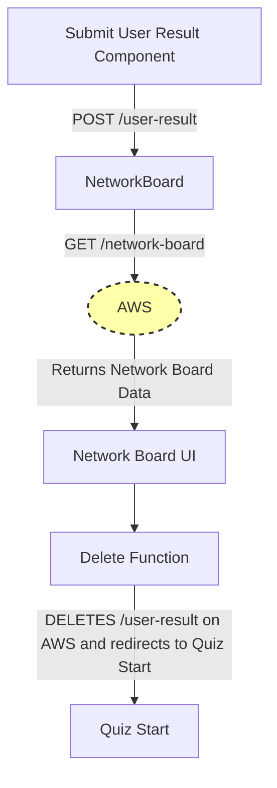

```mermaid
flowchart TD
    A[Submit User Result Component] -->|POST /user-result| B[NetworkBoard]
    B -->|GET /network-board| C[AWS]
    style C fill:#ffa,stroke:#333,stroke-width:2px,stroke-dasharray: 5 5,rx: 100px,ry: 100px
    C -->|Returns Network Board Data| D[Network Board UI]
    D --> E[Delete Function]
    E -->|DELETES /user-result on AWS and redirects to Quiz Start| F[Quiz Start]
```