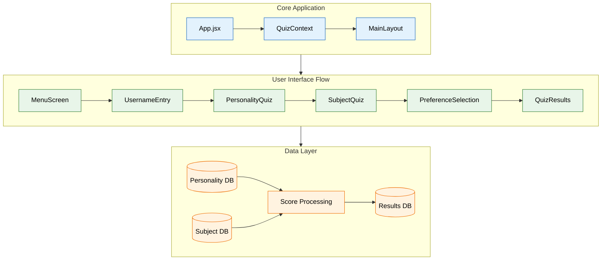
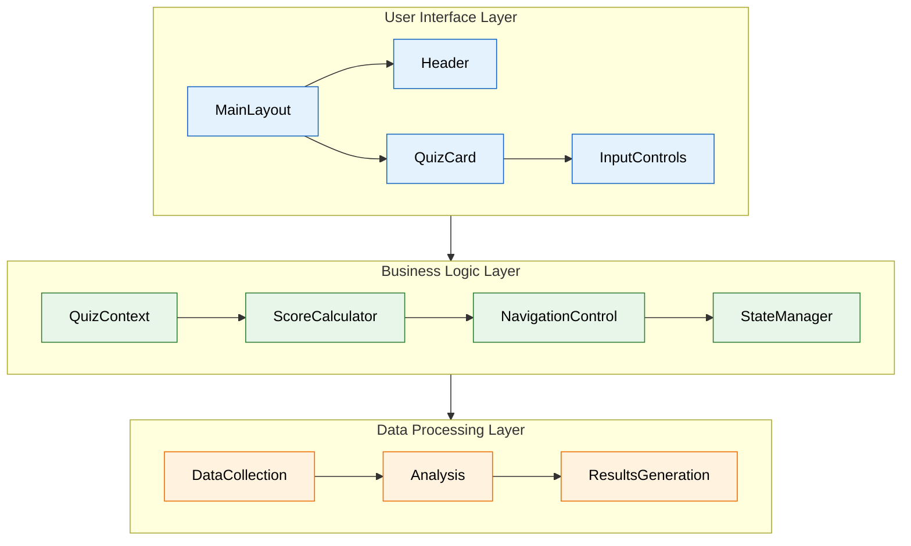
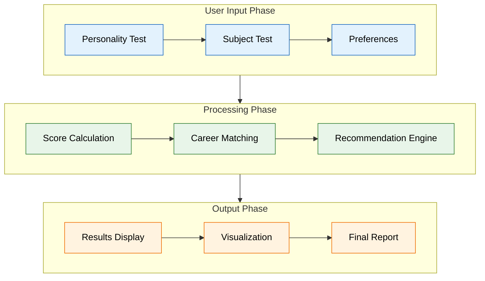

# Technical Architecture

## Client Application Flow

```mermaid
flowchart TB
    %% Row 1: Core Application Structure
    subgraph Core ["Core Application"]
        direction LR
        A[App.jsx] --> B[QuizContext]
        B --> C[MainLayout]
    end

    %% Row 2: User Interface Flow
    subgraph Interface ["User Interface Flow"]
        direction LR
        D[MenuScreen] --> E[UsernameEntry]
        E --> F[PersonalityQuiz]
        F --> G[SubjectQuiz]
        G --> H[PreferenceSelection]
        H --> I[QuizResults]
    end

    %% Row 3: Data Management
    subgraph Data ["Data Layer"]
        direction LR
        J[(Personality DB)] --> K[Score Processing]
        L[(Subject DB)] --> K
        K --> M[(Results DB)]
    end

    %% Connect the rows
    Core --> Interface
    Interface --> Data

    classDef core fill:#e3f2fd,stroke:#1565c0,color:#000
    classDef interface fill:#e8f5e9,stroke:#2e7d32,color:#000
    classDef data fill:#fff3e0,stroke:#ef6c00,color:#000

    class A,B,C core
    class D,E,F,G,H,I interface
    class J,K,L,M data
```

## Component Architecture

```mermaid
flowchart TB
    %% Row 1: UI Components
    subgraph UI ["User Interface Layer"]
        direction LR
        A[MainLayout] --> B[Header]
        A --> C[QuizCard]
        C --> D[InputControls]
    end
    
    %% Row 2: Business Logic
    subgraph Logic ["Business Logic Layer"]
        direction LR
        E[QuizContext] --> F[ScoreCalculator]
        F --> G[NavigationControl]
        G --> H[StateManager]
    end
    
    %% Row 3: Data Processing
    subgraph Processing ["Data Processing Layer"]
        direction LR
        I[DataCollection] --> J[Analysis]
        J --> K[ResultsGeneration]
    end

    %% Connect the rows
    UI --> Logic
    Logic --> Processing

    classDef ui fill:#e3f2fd,stroke:#1565c0,color:#000
    classDef logic fill:#e8f5e9,stroke:#2e7d32,color:#000
    classDef process fill:#fff3e0,stroke:#ef6c00,color:#000

    class A,B,C,D ui
    class E,F,G,H logic
    class I,J,K process
```

## Data Flow Pipeline

```mermaid
flowchart TB
    %% Row 1: User Input Collection
    subgraph Input ["User Input Phase"]
        direction LR
        A[Personality Test] --> B[Subject Test]
        B --> C[Preferences]
    end
    
    %% Row 2: Processing Logic
    subgraph Process ["Processing Phase"]
        direction LR
        D[Score Calculation] --> E[Career Matching]
        E --> F[Recommendation Engine]
    end
    
    %% Row 3: Output Generation
    subgraph Output ["Output Phase"]
        direction LR
        G[Results Display] --> H[Visualization]
        H --> I[Final Report]
    end

    %% Connect the rows
    Input --> Process
    Process --> Output

    classDef input fill:#e3f2fd,stroke:#1565c0,color:#000
    classDef process fill:#e8f5e9,stroke:#2e7d32,color:#000
    classDef output fill:#fff3e0,stroke:#ef6c00,color:#000

    class A,B,C input
    class D,E,F process
    class G,H,I output
```

