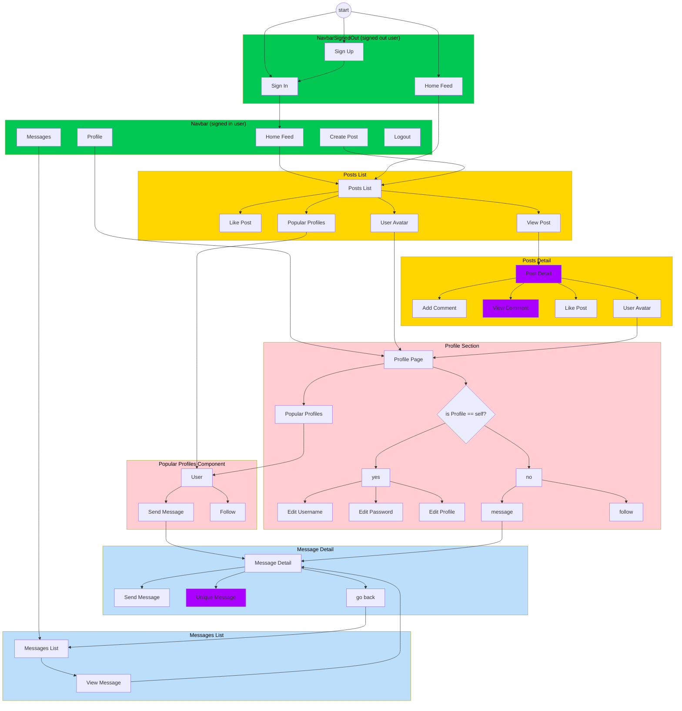

# **Frontend Readme** <!-- omit from toc -->

This readme chapter explains the frontend of the Odyssey app. The frontend is built with React, using a variety of libraries and tools to create a dynamic and responsive user interface.

## Structure of the Application

The user stories are covered more thoroughtly in the `Agile Methodology` section. Key User Stories to understand the structure of the application are:

- **As a user**, I can sign up and log into the app to access my personalized messaging dashboard.
- **As a user**, I can view a list of all my ongoing conversations and quickly access any of them.
- **As a user**, I can start a new conversation with another user by sending the first message.
- **As a user**, I can send and receive messages in real-time within an ongoing conversation.
- **As a user**, I can view detailed information about a conversation, including its history and any attached media.


**Diagram of the Frontend Structure:**





Website Navigation for signed in user

Purple indicates that the user can EDIT or DELETE the content, providing they are the owner.

Authentication was omitted from the diagram for readability. To summarise:
- The signed out Navbar offers option to SIGN IN or SIGN UP.
- Once signed in, the user can sign out in the navbar.
- A signed out user
  - cannot access messages
  - cannot see options for like or follow
  - cannot create or edit a post

### Inputs and Validation

| Feature | Input Fields | Frontend Validation | Backend Validation |
|---------|--------------|---------------------|---------------------|
| Sign Up | - Username (required)<br>- Password (required)<br>- Password confirmation (required) | File: `frontend/src/pages/auth/SignUpForm.js`<br>- Checks for field completion<br>- Displays server-side errors <br>- Field may not be blank <br> -Username cannot contain spaces <br> - displays Bootstrap Alerts such as `{errors.non_field_errors?.map((message, idx) => ( <Alert key={idx} > {message} </Alert> ))}` | Files: `drf_api/settings.py`, `drf_api/serializers.py`<br>- Uses default dj-rest-auth registration validators with `AUTH_PASSWORD_VALIDATORS`<br>- Creates profile via signal in drf_api app<br>- Django's default password validators apply, quoted here from docs: <br><br> - **UserAttributeSimilarityValidator**: Checks the similarity between the password and a set of attributes of the user.<br>- **MinimumLengthValidator**: Checks whether the password meets a minimum length. This validator is configured with a custom option: it now requires the minimum length to be nine characters, instead of the default eight.<br>- **CommonPasswordValidator**: Checks whether the password occurs in a list of common passwords. By default, it compares to an included list of 20,000 common passwords.<br>- **NumericPasswordValidator**: Checks whether the password isn’t entirely numeric.|
| Sign In | - Username (required)<br>- Password (required) | File: `frontend/src/pages/auth/SignInForm.js`<br>- Checks for field completion<br>- Handles authentication errors that may arise from `dj-rest-auth` in the API | File: `drf_api/urls.py`<br>- Uses dj-rest-auth for login<br>-`dj-rest-auth` framework uses Django's [`authenticate()` method](https://docs.djangoproject.com/en/5.1/topics/auth/default/#django.contrib.auth.authenticate) to ensure username and password match the database.
| Create Post | - Title (required)<br>- Content (optional)<br>- Image (optional) | File: `frontend/src/pages/posts/PostCreateForm.js`<br>- Checks title is not empty<br>- Client-side image preview | Files: `posts/serializers.py`, `posts/models.py`<br>- Validates image size (max 2MB) and dimensions (max 4096px in width or height)<br>- Handles image upload to Cloudinary<br>- Uses function to get default image if none provided |
| Send Message | - Content (required for text)<br>- Image (optional) | File: `frontend/src/pages/messaging/MessageDetailSendForm.js`<br>- Ensures content or image is present<br>- Handles image upload | Files: `messaging/views/message_detail_send_view.py`, `messaging/serializers.py`<br>- Validates message creation and recipient existence<br>- Validates content is not blank when no image<br>- Validates image upload (max 5MB, file type) |
| Update Profile | - Name (optional)<br>- Content/Bio (optional)<br>- Image (optional) | File: `frontend/src/pages/profiles/ProfileEditForm.js`<br>- Handles image upload and preview | File: `profiles/serializers.py`<br>- Validates image upload to Cloudinary<br>- No explicit validation on name and content fields |
| Like/Unlike Post | - No input (toggle action) | File: `frontend/src/pages/posts/Post.js`<br>- UI toggle for like/unlike<br>- Updates like count | Files: `likes/models.py`, `likes/serializers.py`, `likes/views.py`<br>- Ensures uniqueness with `unique_together` in model<br>- `LikeSerializer` handles uniqueness in create method<br>- Handles creation and deletion of Like objects |
| Follow/Unfollow User | - No input (toggle action) | File: `frontend/src/pages/profiles/Profile.js`<br>- UI toggle for follow/unfollow | Files: `followers/models.py`, `followers/serializers.py`, `followers/views.py`<br>- Ensures uniqueness with `unique_together` in model<br>- `FollowerSerializer` handles uniqueness in create method<br>- Manages Follower object creation and deletion |
| Update Username | - New Username (required) | File: `frontend/src/pages/profiles/UsernameForm.js`<br>- Checks new username is not empty<br>- Displays server-side errors | File: `drf_api/urls.py`<br>- Uses dj-rest-auth for username update<br>- Django's built-in uniqueness validation applies |
| Update Password | - Current Password (required)<br>- New Password (required)<br>- Confirm New Password | File: `frontend/src/pages/profiles/UserPasswordForm.js`<br>- Ensures all fields are filled<br>- Checks new passwords match | File: `drf_api/urls.py`<br>- Uses dj-rest-auth for password change<br>- Django's built-in password validators apply |

Both frontend and backend implement validation to ensure data integrity and security. The frontend provides immediate feedback to users, while the backend performs thorough checks before processing the data. Error messages from the server are caught by the frontend and displayed to the user for a seamless experience.

# Reusable Components

## SuccessAlert Component


The Odyssey app includes a reusable SuccessAlert component to provide user feedback for successful operations. This component enhances the user experience by offering clear, dismissible notifications.

Here's the implementation of the SuccessAlert component:

```jsx
import React from 'react';
import Alert from 'react-bootstrap/Alert';

const SuccessAlert = ({ message, onClose }) => (
  <Alert variant="success" dismissible onClose={onClose}>
    {message}
  </Alert>
);

export default SuccessAlert;
```

Key features of the SuccessAlert component:

1. **Reusability**: The component is designed to be easily reused across the application, accepting a custom message as a prop.

2. **Bootstrap Integration**: It utilizes React Bootstrap's Alert component, ensuring consistent styling with the rest of the application.

3. **Dismissible**: The alert includes a close button, allowing users to dismiss it when they've acknowledged the message.

4. **Customizable Behavior**: The `onClose` prop allows parent components to define custom behavior when the alert is dismissed.

5. **Semantic Styling**: The "success" variant clearly indicates the positive nature of the notification.

Usage example in SigninForm.js:

```jsx
import React, { useState } from 'react';
import SuccessAlert from './SuccessAlert';

const ParentComponent = () => {
  const [showAlert, setShowAlert] = useState(false);

  const handleOperation = () => {
    // Perform some operation
    setShowAlert(true);
  };

  return (
    <div>
      {showAlert && (
        <SuccessAlert 
          message="Operation completed successfully!" 
          onClose={() => setShowAlert(false)}
        />
      )}
      <button onClick={handleOperation}>Perform Operation</button>
    </div>
  );
};
```

This SuccessAlert component demonstrates several important aspects of React development:

- **Composition**: It composes the React Bootstrap Alert component with custom props and behavior.
- **Prop Usage**: It accepts and utilizes props for customization (`message` and `onClose`).
- **Conditional Rendering**: In the usage example, the alert is conditionally rendered based on state.
- **Separation of Concerns**: The alert's appearance and basic behavior are encapsulated, while specific use cases are handled by parent components.

By implementing this SuccessAlert component, the Odyssey app provides a consistent and user-friendly way to communicate successful operations to users. This enhances the overall user experience and demonstrates attention to detail in user interface design and feedback mechanisms.

## Logo Component


The Odyssey app features a custom, scalable vector graphics (SVG) logo created entirely with code. This approach ensures the logo remains crisp at any size and allows for easy manipulation through CSS and JavaScript.

Here's the implementation of the Logo component:

```jsx
import React from 'react';
import styles from '../styles/modules/Logo.module.css';

const Logo = () => {
  return (
    <div className={styles.logoContainer}>
      <svg xmlns="http://www.w3.org/2000/svg" viewBox="0 0 100 100" width="100" height="100">
        <circle cx="50" cy="50" r="50" className={styles.logoBg} />
        <g transform="rotate(-56, 50, 50)" className={styles.logoContent}>
            {/* Top-left quadrant */}
          <path d="M50 50 L14.64 14.64 L50 25 Z" className={styles.logoPrimary} />
          <path d="M50 50 L50 25 L85.36 14.64 Z" className={styles.logoSecondary} />
          
          {/* Top-right quadrant */}
          <path d="M50 50 L85.36 14.64 L75 50 Z" className={styles.logoPrimary} />
          <path d="M50 50 L75 50 L85.36 85.36 Z" className={styles.logoSecondary} />
          
          {/* Bottom-right quadrant */}
          <path d="M50 50 L85.36 85.36 L50 75 Z" className={styles.logoPrimary} />
          <path d="M50 50 L50 75 L14.64 85.36 Z" className={styles.logoSecondary} />
          {/*... etc. for Bottom-left quadrant */}
        </g>
      </svg>
    </div>
  );
};

export default Logo;
```

Key features of this logo implementation:

1. **SVG Structure**: The logo is built using SVG, which allows for perfect scaling at any resolution.

2. **Geometric Design**: The logo consists of a circular background with eight triangular segments arranged in a pinwheel pattern.

3. **CSS Integration**: The logo uses CSS modules (`styles.logoContainer`, `styles.logoBg`, etc.) for styling, allowing for easy theming and animations.

4. **Rotation**: The inner segments are rotated 56 degrees counterclockwise using the SVG `transform` attribute, creating a dynamic appearance.

5. **Color Scheme**: The segments alternate between two colors (defined by `styles.logoPrimary` and `styles.logoSecondary`), creating visual interest and depth.

The logo's design, reminiscent of a compass or a stylized "O" for Odyssey, visually reinforces the app's themes of exploration and navigation. Its geometric nature also suggests precision and technology, appropriate for a modern web application.

By implementing the logo as a component, it can be easily incorporated into various parts of the application, such as the `NavBar` and `Banner`:

```jsx
import Logo from "./Logo";

const NavBarDesktop = () => {
  return (
    <nav className={styles.NavBarDesktop}>
      <div className={styles.LogoContainer}>
        <Logo />
      </div>
      {/* ... other navbar content ... */}
    </nav>
  );
};
```

This approach to logo design and implementation showcases attention to detail, and also allows future customization and extension of the logo's appearance and behavior e.g. animation.


## NavBar Component set - NavbarDesktop, NavbarMobile and NavBarMore

|  |  |  |
|----|-----|----|
|  *Navbar Desktop* | *Navbar Mobile* | *NavbarMore* |

The Odyssey app features a responsive navigation bar that adapts to different screen sizes, providing an optimal user experience across devices. This is achieved through two main components: `NavBarDesktop` for larger screens and `NavBarMobile` for smaller devices. `NavBarMore` is a dropdown menu that appears when additional navigation options are needed.

The app determines which NavBar to display based on the screen width:

```jsx
import useWindowSize from "./hooks/useWindowSize";

function App() {
  const size = useWindowSize();

  return (
    <div className={styles.App}>
      {/* Other components */}
      {size.width <= 768 ? <NavBarMobile /> : <NavBarDesktop />}
    </div>
  );
}
```

Both NavBar components share common functionality but differ in layout and interaction design:

1. **NavBarDesktop**: Positioned at the top of the screen, it displays all navigation options horizontally.

2. **NavBarMobile**: Fixed to the bottom of the screen, it uses icons with labels for compact navigation.

Both components dynamically render different sets of navigation items based on the user's authentication status. Here's an example from `NavBarMobile`:

```jsx
const NavBarMobile = () => {
  const currentUser = useCurrentUser();
  const [isMoreOpen, setIsMoreOpen] = useState(false);

  const loggedInIcons = (
    <>
      <div className={styles.NavItem}>
        <NavLink exact to="/" className={styles.NavLink} activeClassName={styles.Active}>
          <FontAwesomeIcon icon={faCompass} />
        </NavLink>
        <span>Feed</span>
      </div>
      {/* Other logged-in navigation items */}
    </>
  );

  const loggedOutIcons = (
    <>
      <div className={styles.NavItem}>
        <NavLink exact to="/" className={styles.NavLink} activeClassName={styles.Active}>
          <FontAwesomeIcon icon={faCompass} />
        </NavLink>
        <span>Explore</span>
      </div>
      {/* Other logged-out navigation items */}
    </>
  );

  return (
    <Navbar className={styles.NavBarMobile} fixed="bottom">
      <Container>
        <Nav className="w-100 justify-content-around">
          {currentUser ? loggedInIcons : loggedOutIcons}
        </Nav>
      </Container>
    </Navbar>
  );
};
```

The NavBar components also integrate with the app's theming system. They include a theme toggle button that changes the app's appearance between light and dark modes:

```jsx
const { lightMode, setLightMode } = useContext(ThemeContext);

const toggleTheme = () => {
  setLightMode(!lightMode);
};

// In the navigation items:
<div className={styles.NavItem} onClick={toggleTheme}>
  <div className={styles.NavLink}>
    <FontAwesomeIcon icon={lightMode ? faMoon : faSun} />
  </div>
  <span>{lightMode ? "Dark Mode" : "Light Mode"}</span>
</div>
```

For additional navigation options, both components utilize a `NavBarMore` component. This component appears as a dropdown menu, providing access to the user's profile, theme toggle, and sign-out option:

```jsx
const NavBarMore = ({ onClose, isDesktop }) => {
  const currentUser = useCurrentUser();
  const setCurrentUser = useSetCurrentUser();
  const { lightMode, setLightMode } = useContext(ThemeContext);
  const history = useHistory();
  const moreRef = useRef(null);
  const [hoveredItem, setHoveredItem] = useState(null);

  useEffect(() => {
    const handleClickOutside = (event) => {
      if (moreRef.current && !moreRef.current.contains(event.target)) {
        onClose();
      }
    };

    document.addEventListener("mousedown", handleClickOutside);
    return () => {
      document.removeEventListener("mousedown", handleClickOutside);
    };
  }, [onClose]);

  const handleSignOut = async (e) => {
    e.preventDefault();
    try {
      await axios.post("dj-rest-auth/logout/");
      setCurrentUser(null);
      removeTokenTimestamp();
      history.push('/');
      onClose();
    } catch (err) {
      // Handle error
    }
  };

  // ... Light/Dark Theme Logic ... //

  const handleProfileClick = (e) => {
    e.preventDefault();
    history.push(`/profiles/${currentUser?.profile_id}`);
    onClose();
  };

  const NavItem = ({ icon, text, onClick, itemKey }) => (
    <div 
      className={`${styles.NavItem} ${hoveredItem === itemKey ? styles.NavItemHovered : ''}`}
      onClick={onClick}
      onMouseEnter={() => setHoveredItem(itemKey)}
      onMouseLeave={() => setHoveredItem(null)}
    >
      <FontAwesomeIcon icon={icon} />
      <span className={styles.NavItemSpan}>{text}</span>
    </div>
  );

  return (
    <div className={`${styles.NavBarMore} ${isDesktop ? styles.NavBarMoreDesktop : ''}`} ref={moreRef} >
      <NavItem data-id="go-to-profile" icon={faUser} text="My Profile" onClick={handleProfileClick} itemKey="profile" />
      <NavItem icon={lightMode ? faMoon : faSun} text="Color Theme" onClick={toggleTheme} itemKey="theme" />
      <NavItem icon={faSignOutAlt} text="Sign Out" onClick={handleSignOut} itemKey="signout" />
    </div>
  );
};
```

By implementing this responsive NavBar, the Odyssey app ensures a consistent and user-friendly navigation experience across all devices while maintaining a clean and modular code structure.

## MoreDropdown Component

|  |  |  |  |
|------------------|------------------|--------------|---------|
| *MessageDetail Dropdown* | *ProfileEdit Dropdown* | *Comment Dropdown* | *MoreDropdown Post* |

The Odyssey app features a versatile MoreDropdown component that provides contextual options for various elements throughout the application. This component enhances user interaction by offering a clean, consistent interface for additional actions.

The MoreDropdown component is implemented with three variants:

1. `MoreDropdown`: For Post editing options
2. `MoreDropdownComment`: For comment editing options.
3. `ProfileEditDropdown`: Specifically for profile editing options.
4. `MessageDetailDropdown`: For message editing options.

Here's a key sample of the implementation focusing on the Post variant:

```jsx
const ThreeDots = React.forwardRef(({ onClick }, ref) => (
  <i
    className="fas fa-ellipsis-v"
    ref={ref}
    onClick={(e) => {
      e.preventDefault();
      onClick(e);
    }}
  />
));

export const MoreDropdown = ({ handleEdit, handleDelete }) => {
  return (
    <Dropdown className="ml-auto" drop="left">
      <Dropdown.Toggle as={ThreeDots} />
      <Dropdown.Menu>
        <Dropdown.Item
          className={styles.DropdownItem}
          onClick={handleEdit}
          aria-label="edit"
        >
          <i className="fas fa-edit" /> Edit Post
        </Dropdown.Item>
        <Dropdown.Item
          className={styles.DropdownItem}
          onClick={handleDelete}
          aria-label="delete"
        >
          <i className="fas fa-trash-alt" /> Delete Post
        </Dropdown.Item>
      </Dropdown.Menu>
    </Dropdown>
  );
};
```

Key features of the MoreDropdown component are that it often accepts `handleEdit` and `handleDelete` props, allowing for customized behavior.

Usage in the application:

1. **Post Component**: The `MoreDropdown` is used in the Post component to provide edit and delete options for post owners.

   ```jsx
   import { MoreDropdown } from "../../components/MoreDropdown";

   const Post = ({ id, owner, handleEdit, handleDelete }) => {
     return (
       <Card>
         {is_owner && (
           <MoreDropdown
             handleEdit={handleEdit}
             handleDelete={handleDelete}
           />
         )}
         {/* Other post content */}
       </Card>
     );
   };
   ```

2. **ProfilePage**: The `ProfileEditDropdown` is used in the ProfilePage component to offer profile editing options.

   ```jsx
   import { ProfileEditDropdown } from "../../components/MoreDropdown";

   const ProfilePage = ({ id, isOwner }) => {
     return (
       <Row>
         {isOwner && <ProfileEditDropdown id={id} />}
         {/* Other profile content */}
       </Row>
     );
   };
   ```

3. **MessageDetail**: The `MessageDetailDropdown` is used in the `MessageDetail` component for message-specific actions.

   ```jsx
   import { MessageDetailDropdown } from "../../components/MoreDropdown";

   // handleEdit and handleDelete functions are declared here

   const MessageDetail = ({ id, isOwner, handleEdit, handleDelete }) => {
     return (
       <div>
         {isOwner && (
           <MessageDetailDropdown
             handleEdit={handleEdit}
             handleDelete={handleDelete}
           />
         )}
         {/* Message content */}
       </div>
     );
   };
   ```

This MoreDropdown component demonstrates several important React development concepts:

- **Component Composition**: It uses React Bootstrap's Dropdown component as a base, extending its functionality.
- **Render Props**: The `ThreeDots` component uses the `forwardRef` API to work with React Bootstrap's Dropdown.
- **Prop Drilling**: It passes down handler functions to manage actions in parent components.
- **Conditional Rendering**: The dropdowns are only shown to content owners or in specific contexts.

By implementing this versatile MoreDropdown component, the Odyssey app maintains a cleaner interface for additional actions across different parts of the application, enhancing user experience and demonstrating good practices in React component design.

## Asset Component

|  |  |  | 
|------------------|------------------|--------------|
| *Asset Spinner* | *Asset Message in Empty Post List (in this case Liked posts, also works for following and posts)* | *Asset Message in empty chat, prompts user to get the conversation started* | 

The Odyssey app features a versatile Asset component that serves multiple purposes, primarily for displaying loading states, images, and messages. This reusable component enhances the user experience by providing consistent visual feedback across different parts of the application.

Here's the implementation of the Asset component:

```jsx
import React from "react";
import Spinner from "react-bootstrap/Spinner";
import styles from "../styles/modules/Asset.module.css";

const Asset = ({ spinner, src, message }) => {
  return (
    <div className={`${styles.Asset} p-4`}>
      {spinner && <Spinner animation="border" className={styles.AssetSpinner} />}
      {message && <p className={`mt-4 ${styles.AssetUpload}`}>{message}</p>}
    </div>
  );
};

export default Asset;
```

Key features of the Asset component:

1. **Flexible Display**: Can show a spinner, an image (currently commented out), a message, or any combination of these based on the props passed.

2. **Loading Indicator**: Utilizes React Bootstrap's Spinner component to display a loading animation when the `spinner` prop is true.

3. **Custom Styling**: Uses CSS modules (`styles.Asset`, `styles.AssetSpinner`, `styles.AssetUpload`) for scoped styling, preventing conflicts with other components.

4. **Conditional Rendering**: Only renders elements (spinner, image, message) if the corresponding props are provided.

5. **Reusability**: Designed to be used in various contexts throughout the app, promoting consistent UI patterns.

Usage examples:

1. As a loading indicator in the `posts` feed:
   ```jsx
   <Asset spinner />
   ```

2. To display a message e.g. when no posts are available:
   ```jsx
   <Asset message="No results found" />
   ```

The Asset component can be used in various scenarios throughout the Odyssey app:

1. During data fetching operations to indicate loading states.
2. In list views to show when no items are available.

By utilizing the Asset component, the Odyssey app maintains consistent loading states and messaging across different features. This enhances the overall user experience by providing clear guided feedback in edge cases or during asynchronous operations where content may not be immediately available.

## Skeleton Components for Loading States


|  |  |  |   |  |  |
|----|----|----|----|----|----|
|*Popular Profiles Skeleton* | *Profile Skeleton* | *Message List Skeleton* | *Message Detail Skeleton* | *Post Skeleton* | *Comment Skeleton* | 

Example above of a skeleton component for profiles and Popular Profiles.

The Odyssey app uses skeleton components to improve perceived loading times and provide a smoother user experience. These components display placeholder UIs while content is being fetched, giving users immediate visual feedback.

The app implements six skeleton components:

1. ProfileSkeleton
2. PostSkeleton
3. PopularProfilesSkeleton
4. MessageListSkeleton
5. CommentSkeleton
6. MessageDetailSkeleton

Each component is modular, reusable, and styled using CSS modules to prevent style conflicts. Here's an example of the CommentSkeleton component:

```jsx
import React from 'react';
import styles from '../styles/modules/CommentSkeleton.module.css';

const CommentSkeleton = () => {
  return (
    <div className={styles.commentSkeleton}>
      <div className={styles.avatarSkeleton}></div>
      <div className={styles.contentSkeleton}>
        <div className={styles.nameSkeleton}></div>
        <div className={styles.textSkeleton}></div>
      </div>
    </div>
  );
};

export default CommentSkeleton;
```

This component uses a functional structure and CSS modules for scoped styling. It mimics the layout of a real comment, providing placeholders for the avatar, name, and text content.

Many of the skeleton components generate multiple placeholder items dynamically:

```jsx
<div className={styles.messageListSkeleton}>
  {[...Array(5)].map((_, index) => (
    <div key={index} className={styles.messageSkeleton}>
      {/* Skeleton item content */}
    </div>
  ))}
</div>
```

This approach allows the skeletons to adapt to varying amounts of content, maintaining an accurate representation of the page structure during loading.

The skeleton components also consider accessibility. By preserving the layout of the actual content, they help screen reader users understand the page structure even while content is loading.

These components contribute to the overall performance and user experience of the Odyssey app. They demonstrate practical implementation of React concepts including modular design, dynamic content generation, and accessibility considerations.

## NotFound Component


The Odyssey app includes a NotFound component to handle cases where users attempt to access non-existent pages or resources. This component enhances user experience by providing clear feedback when navigation errors occur.

Here's the implementation of the NotFound component:

```jsx
import React from "react";
import NoResults from "../assets/no-results.png";
import styles from "../styles/modules/NotFound.module.css";
import Asset from "./Asset";

const NotFound = () => {
  return (
    <div className={styles.NotFound}>
      <Asset
        src={NoResults}
        message={`Sorry, the page you're looking for doesn't exist`}
      />
    </div>
  );
};

export default NotFound;
```

It leverages the `Asset` component, demonstrating good component composition and reusability.

Usage example in routing:

```jsx
import { Route, Switch } from "react-router-dom";
import NotFound from "./components/NotFound";

function App() {
  return (
    <Switch>
      <Route exact path="/" component={Home} />
      <Route path="/profile" component={Profile} />
      {/* Other routes */}
      <Route component={NotFound} />
    </Switch>
  );
}
```

Implementing the NotFound component showcases attention to detail in error handling and user experience. It ensures that users receive clear feedback when they encounter navigation errors, maintaining a polished and professional feel throughout the application, even in edge cases.

By implementing and strategically using the NotFound component, the Odyssey app demonstrates a commitment to comprehensive error handling and a smooth user experience, even when users encounter invalid routes or resources.

## Banner Component


The Odyssey app features a dynamic Banner component that serves as the app's header, providing branding and user feedback. This component enhances the user experience by offering a consistent visual identity and contextual notifications.

Here's the key part of the Banner component implementation:

```jsx
import React, { useEffect, useState } from "react";
import { Container, Row, Col } from "react-bootstrap";
import { useLocation } from "react-router-dom";
import styles from "../styles/modules/Banner.module.css";
import Logo from "./Logo";
import SuccessAlert from "./SuccessAlert";

const Banner = () => {
  const [showSuccessAlert, setShowSuccessAlert] = useState(false);
  const [successMessage, setSuccessMessage] = useState("");
  const location = useLocation();

  useEffect(() => {
    const searchParams = new URLSearchParams(location.search);
    const success = searchParams.get('success');
    
    if  (success === 'signin') {
      setSuccessMessage("Sign in successful! Welcome back to Odyssey!");
      setShowSuccessAlert(true);

      const timer = setTimeout(() => {
        setShowSuccessAlert(false);
      }, 5000);

      return () => clearTimeout(timer);
    }
  }, [location]);

  return (
    <Container fluid className={`py-4 mb-3 ${styles.Background}`} style={{ borderRadius: '20px' }}>
      <Row className="align-items-center text-center text-lg-left">
        {showSuccessAlert && (
          <SuccessAlert
            message={successMessage}
            onClose={() => setShowSuccessAlert(false)}
          />
        )}
        <Col xs={12} lg={4} className="mb-3 mb-lg-0">
          <Logo />
        </Col>
        <Col xs={8} lg={8} className="m-auto">
          <h1 className={`bold ${styles.Title}`}>ODYSSEY</h1>
          <p className={`muted ${styles.SubTitle}`}>
            Discover the power of shared goals. Explore posts, follow popular profiles, and stay connected with the
            community through our messaging feature.
          </p>
        </Col>
      </Row>
    </Container>
  );
};
```

This Banner component demonstrates several important React and front-end development concepts:

- **Component Composition**: Integrates smaller components like `Logo` and `SuccessAlert` to build a more complex UI.
- **Hooks Usage**: Employs `useState` and `useEffect` hooks for state management and side effects.
- **Responsive Web Design**: Adapts its layout for different screen sizes using Bootstrap's grid system.
- **URL Parameter Handling**: Parses and responds to URL parameters to display contextual information.
- **Timed Effects**: Implements auto-dismissing alerts using `setTimeout` and cleans up with `clearTimeout` to prevent memory leaks.

The Banner is currently placed at the top of `PostsPage`.

It plays a crucial role in the Odyssey app by:

1. Providing a consistent header across different pages, reinforcing the app's brand identity.
2. Summarizing the app's key features, helping new users understand the app's purpose.

## Avatar Component


The Odyssey app includes a reusable Avatar component that displays user profile images consistently throughout the application. This component enhances the user interface by providing a uniform way to represent users visually.

Here's the implementation of the Avatar component:

```jsx
import React from "react";
import styles from "../styles/modules/Avatar.module.css";

const Avatar = ({ src, height = 45, text }) => {
  return (
    <span>
      
      {text}
    </span>
  );
};

export default Avatar;
```

Usage examples:

1. Basic usage with default size:
   ```jsx
   <Avatar src={user.profileImage} />
   ```

2. Custom size with text:
   ```jsx
   <Avatar src={user.profileImage} height={60} text="Username" />
   ```

3. In a user list or comment section:
   ```jsx
   <div>
     {users.map(user => (
       <div key={user.id}>
         <Avatar src={user.profileImage} text={user.username} />
       </div>
     ))}
   </div>
   ```

The Avatar component plays a crucial role in the Odyssey app by:

1. Providing visual identification for users across features like comments, user profiles, and message threads.
2. Maintaining consistent user representation throughout the application.
3. Enhancing the overall aesthetic and user experience of the app.

The Avatar component is used in various parts of the application, such as:

- User profile pages
- Comment sections on posts
- User lists (e.g., followers, following)
- Message detail and MessageList components

Its consistent usage across these features helps users quickly identify and recognize other users, enhancing the social aspects of the Odyssey platform.


## AutoThemeTransition for dark mode theme switching


|  |  |
|------------------|------------------|
|  |  |
| *Light Mode* | *Dark Mode* |

The AutoThemeTransition component in the Odyssey app facilitates smooth theme transitions across the application by adding transition props to child components.

```jsx
import React from 'react';
import { useThemeTransition } from '../contexts/ThemeContext';

export const AutoThemeTransition = ({ children }) => {
  const themeProps = useThemeTransition();
  
  const addPropsToChildren = (children) => {
    return React.Children.map(children, child => {
      if (React.isValidElement(child)) {
        return React.cloneElement(child, themeProps);
      }
      return child;
    });
  };

  return <>{addPropsToChildren(children)}</>;
};
```

Key features:
1. Integrates with ThemeContext via `useThemeTransition` hook.
2. Adds theme transition props to child React elements with `React.Children` API usage
3. Wraps existing components without structural changes.

Usage in `App.js`
```jsx
<AutoThemeTransition>
  <div className="App">
    {/* App components */}
  </div>
</AutoThemeTransition>
```

It enhances the Odyssey app by:
1. Ensuring smooth visual transitions between light and dark themes.
2. Providing a centralized theme transition management.
3. Improving overall user experience with polished theme changes.

Implement by wrapping it around the top-level component and ensuring proper setup of the `useThemeTransition` hook in ThemeContext. This approach demonstrates sophisticated theme management and the ability to create app-wide enhancements using advanced React patterns.


# Responsive Design

To make the app, `react-bootstrap` was used for an efficient workflow.

Where possible the app was designed with a mobile-first approach, ensuring that the app is responsive and accessible across devices.

## UiZard Wireframe

The following UiZard wireframe was used as a starting point for the app's design:


Mobile Design


Desktop Design

The wireframe shows the basic layout of the app, including the navbar, message list, and message detail components. The final design was based on this wireframe, with additional features and styling added to enhance the user experience.

Due to time constraints, the structure of previewing a feed of profiles (rather than posts) was not implemented in the final app. However, the wireframe provided a solid foundation for the app's layout and design.

## Responsive Navbar for Mobile and Desktop

for the Navbar a desktop and mobile component was created to ensure a seamless experience across devices. Then through a hook the Navbar would switch according to screenwidth.

# Surface Rendering

Global vars were used to efficently manage the color scheme and typography.


|  |
|----|
| *---Color Scheme and Typefaces with Root vars* |

these were used to create a consistent and visually appealing design for the app, as shown in the image the variables stylesheet was used to set the color scheme and typography for the app. This provided an efficient workflow.

`Gabarito` was used as the primary typeface for the app, in combination with `Serifa` as the secondary typeface. 

The color scheme was monochrome - to give the app a clean and modern look. The accent color was a vibrant green.

## NavBar Design

Figma was used to create a more detailed wireframe for the app, due to time constraints certain components were focused on.


## Light and Dark Mode with ThemeContext

Odyssey implements a dynamic theme switching feature using React Context. This system allows for seamless toggling between light and dark modes across the application. Let's dive into how this is implemented.

The theming system is primarily implemented in the `frontend/src/contexts/ThemeContext.js` file. Here's a breakdown of its key components:

The `ThemeContext` is created using React's `createContext` function:

```javascript
export const ThemeContext = createContext();
```

This context will hold the current theme state and provide a method to toggle it.

The `ThemeProvider` component is responsible for managing the theme state and providing it to the rest of the application:

```javascript
export const ThemeProvider = ({ children }) => {
  const [lightMode, setLightMode] = useState(() => {
    const savedMode = localStorage.getItem('lightMode');
    return savedMode ? JSON.parse(savedMode) : false;
  });

  const applyTheme = useCallback((isLight) => {
    const root = document.documentElement;

    if (isLight) {
      root.style.setProperty('--color-background', '#FFFFFF');
      root.style.setProperty('--color-secondary-background', '#F0F0F0');
      root.style.setProperty('--color-primary-text', '#333333');
      root.style.setProperty('--color-secondary-text', '#666666');
    } else {
      root.style.setProperty('--color-background', '#121212');
      root.style.setProperty('--color-secondary-background', '#1F1F1F');
      root.style.setProperty('--color-primary-text', '#f0e7e7');
      root.style.setProperty('--color-secondary-text', '#B3B3B3');
    }
  }, []);

  useEffect(() => {
    localStorage.setItem('lightMode', JSON.stringify(lightMode));
    applyTheme(lightMode);
  }, [lightMode, applyTheme]);

  return (
    <ThemeContext.Provider value={{ lightMode, setLightMode }}>
      {children}
    </ThemeContext.Provider>
  );
};
```

Key points:
- The initial theme state is retrieved from localStorage, defaulting to dark mode if not set.
- The `applyTheme` function updates CSS custom properties based on the current theme.
- Theme changes are persisted to localStorage and applied immediately.

**useThemeTransition Hook**

This custom hook provides a way to apply theme transition effects:

```javascript
export const useThemeTransition = () => {
  return { 'data-theme-transition': true };
};
```

**Theme Application**

The theme is applied using CSS custom properties defined in `frontend/src/styles/themeTransitions.css`:

```css
[data-theme-transition] {
  transition: background-color 0.3s ease, color 0.3s ease;
}

:root {
  --color-background: #121212;
  --color-secondary-background: #1F1F1F;
  --color-primary-text: #f0e7e7;
  --color-secondary-text: #B3B3B3;
}
```

These CSS variables are dynamically updated by the `applyTheme` function in the `ThemeProvider`.

Components can access and toggle the theme using the `ThemeContext`. For example, in `frontend/src/components/NavBarDesktop.js`:

```javascript
import React, { useContext } from "react";
import { ThemeContext } from "../contexts/ThemeContext";
import { FontAwesomeIcon } from '@fortawesome/react-fontawesome';
import { faSun, faMoon } from '@fortawesome/free-solid-svg-icons';

const NavBarDesktop = () => {
  const { lightMode, setLightMode } = useContext(ThemeContext);

  const toggleTheme = () => {
    setLightMode(!lightMode);
  };

  return (
    // ... other nav elements ...
    <button onClick={toggleTheme} className={styles.ThemeToggle}>
      <FontAwesomeIcon icon={lightMode ? faMoon : faSun} />
    </button>
    // ... other nav elements ...
  );
};
```

</details>

This implementation allows for a seamless theme switching experience across the Odyssey application, with the current theme persisting between sessions.

