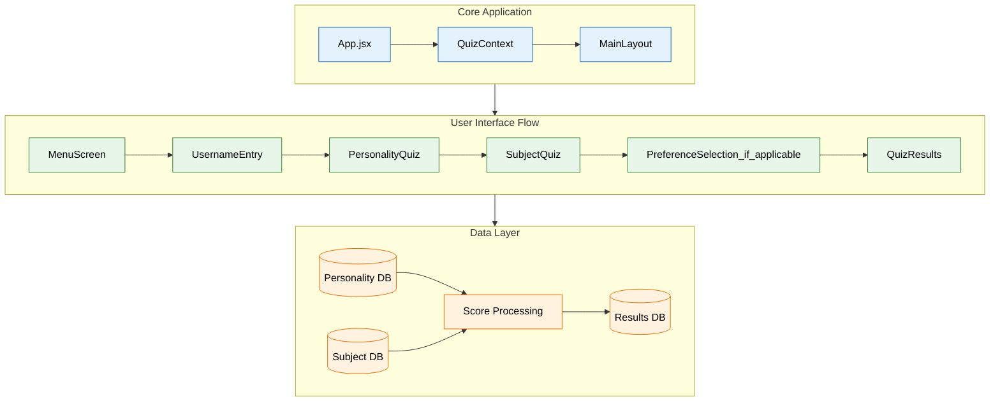
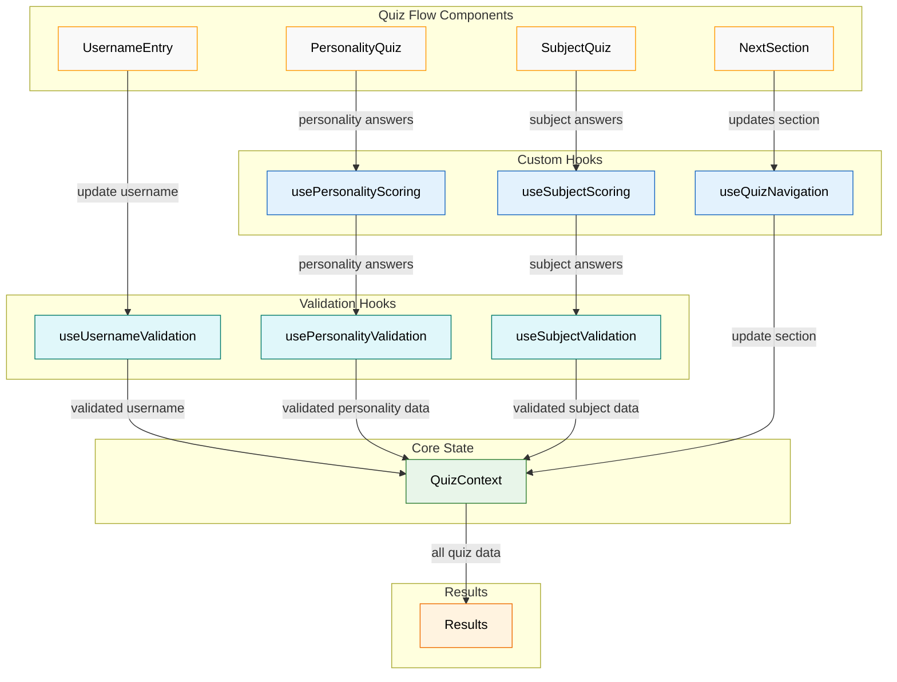
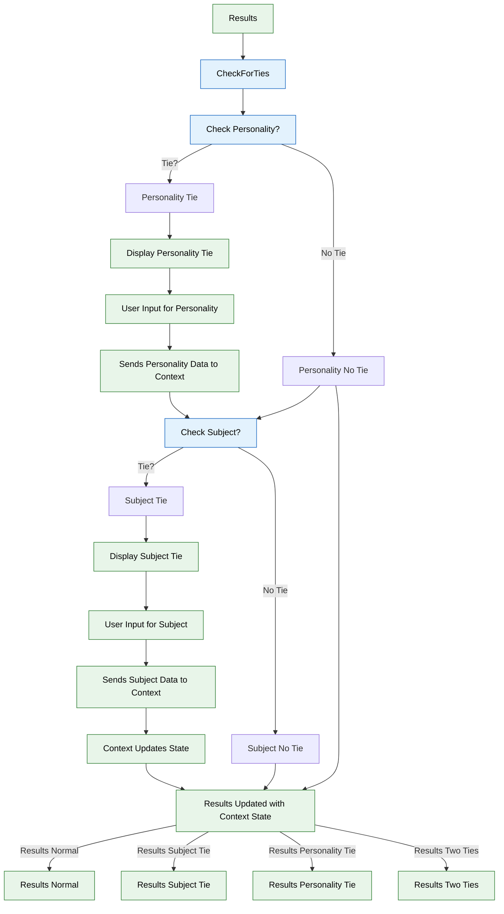
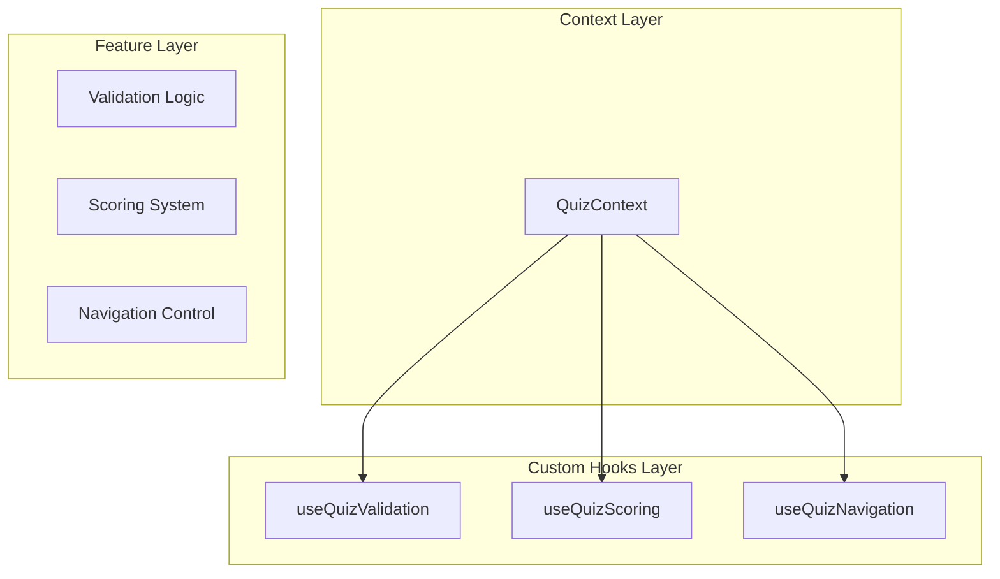

# Technical Architecture

## Client Application Flow

## Component Architecture

## Data Flow Pipeline

# Important Files

## QuizContext.js and Related Hooks

The quiz application uses a combination of Context and Custom Hooks for state management and business logic:

### QuizContext
Acts as the central state container, providing:
- Core state management
- Basic state updates
- Context provider wrapper

### Data Flow Architecture

### CheckForTies edge case

in the case of a tie, the user is asked to select the best option.

When we travel to Results, we check for ties and if there are any, we display the tie and ask the user to select the best option.

### Custom Hooks Architecture

