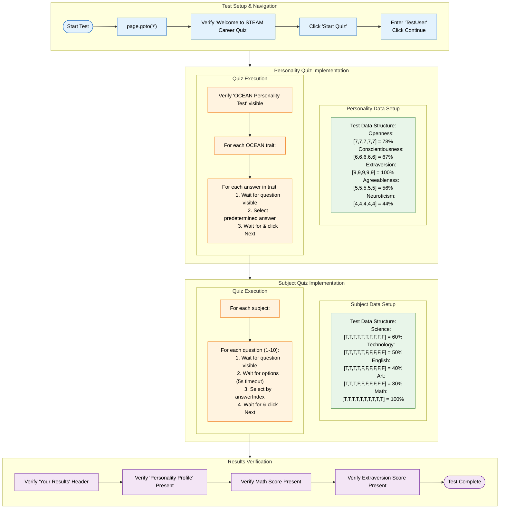
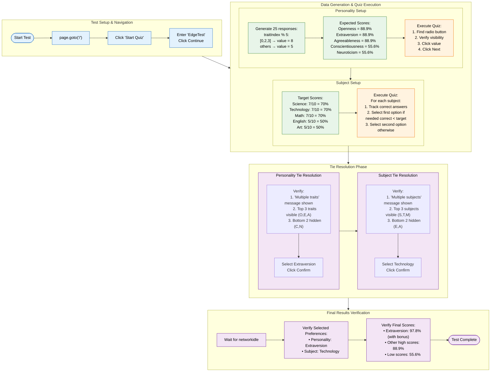

# Automated Test

This Readme chapter introduces the **outcomes** of the Automated and Manual Testing. For instructions of how to carry out the tests refer to the **Usage & Deployment** readme chapter - for readibility it is not covered here.

The testing process favoured **TDD (Test Driven Development)** methodologies, where tests were written before the implementation of features. This approach helps ensure that the codebase remains stable and that new features do not break existing functionality. For that reason the Automatic Testing is introduced first. Manual Testing was then conducted after the completion of the app to ensure that all features work as expected from a user's perspective.

## Playwright Testing
The app includes automatic tests for core components and functionality using testing frameworks like Jest.

### quizflowstandard.test.js

### edgecases.test.js

